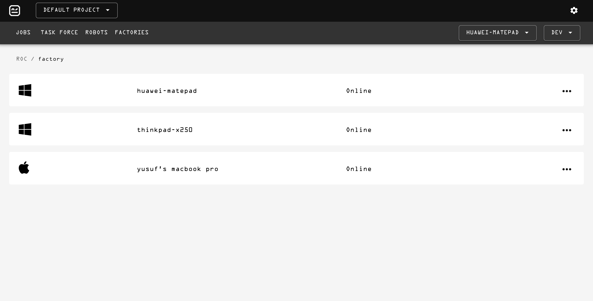

# ROC | Robot Operation Center

Robot Operation Center (ROC) is an Self hosted, lightweight, JVM based software automation platform for every day IT
operations which uses Robot Framework as it's executor. 🤖 🕹

## Overview



### Project Decomposition

- `/agent`: Agent project manages executions on installed platforms.
- `/platform`: Platform project is for backend operations of platform.
- `/web`: Web UI project for platform. Created with `create-react-app`

## Development

Run required services via docker-compose;

```
docker compose up
```

Start platform with;

```
./mvnw compile && ./mvnw -pl platform spring-boot:run
```

Then, start frontend development server;

```shell
cd web
npm install
npm run start
```

## Deployment

Deploy on Kubernetes

```shell
# Coming soon
```
