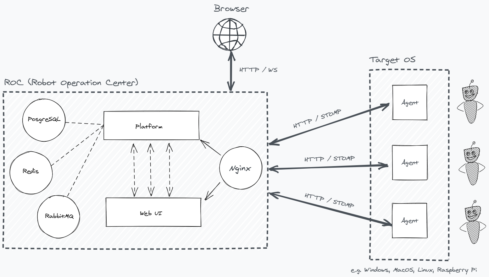

# ROC | Robot Operation Center

Robot Operation Center (ROC) is an Self hosted, lightweight, JVM based software automation platform for every day IT
operations which uses Robot Framework as it's executor. 🤖 🕹

## Overview



### Project Decomposition

- `/agent`: Agent project manages executions on installed platforms.
- `/platform`: Platform project is for backend operations of platform.
- `/web`: Web UI project for platform. Created with `create-react-app`

## Installation

> If you don't have any ROC deployment please skip to the deployment section for deployment steps.


Install ```roc-ctl``` CLI tool for interacting the ROC;


```
npm install -g roc-ctl
```

Then, execute `roc-ctl` command;

```
➜ roc-ctl --help   
Command line interface for ROC (Robot Operation Center)

VERSION
  roc-ctl/0.1.0-alpha.0 darwin-x64 node-v16.13.0

USAGE
  $ roc-ctl [COMMAND]

TOPICS
  agent        Agent operations (e.g. List, Create, Update)
  config       CLI configurations (e.g. Platform URL, Default Project, etc.)
  environment  Environment operations (e.g. List, Create, Update, Upload Variables)
  job          Job operations (e.g. List, View Console, View Logs)
  project      Project operations (e.g. List, Create, Update)
  task-force   Task force operations (e.g. List, Create, Update, Upload Variables)

COMMANDS
  command
  help     Display help for roc-ctl.
```


## Deployment

Start platform using `docker-compose`;

```
docker-compose up -d
```

