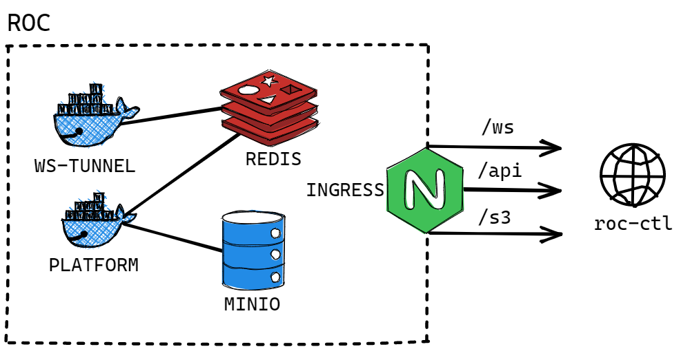

# ROC | Robot Operation Center

[](https://github.com/yusufcanb/roc/actions/workflows/e2e.yml)
[](https://github.com/yusufcanb/roc/actions/workflows/ci.yml)
[](https://sonarcloud.io/summary/new_code?id=yusufcanb_roc)
[](https://sonarcloud.io/summary/new_code?id=yusufcanb_roc)


K8s Native Automation Platform tailored for robot script execution. Provides parallelization and centralized reporting by desing. 🤖 🕹

## Overview



### Project Decomposition

- `packages/cli`: Cross platform CLI application written in Go to manage the platform.
- `packages/platform`: Responsible for execution, distrubution and reporting.
- `packages/tunnel`: Exposes Redis PUB-SUB events through a WebSocket server.

## Deployment

### Using Docker Compose

Clone the repository;

```
git clone https://github.com/yusufcanb/roc
```

Execute command below to run the platform;

```
docker-compose up -d
```

### Kubernetes

> K8s deployment guide will be published soon


## Usage

Download the `roc-ctl` binary via;

```
curl https://github.com/yusufcanb/roc/releases/tag/1.0.0/roc-cli
```
